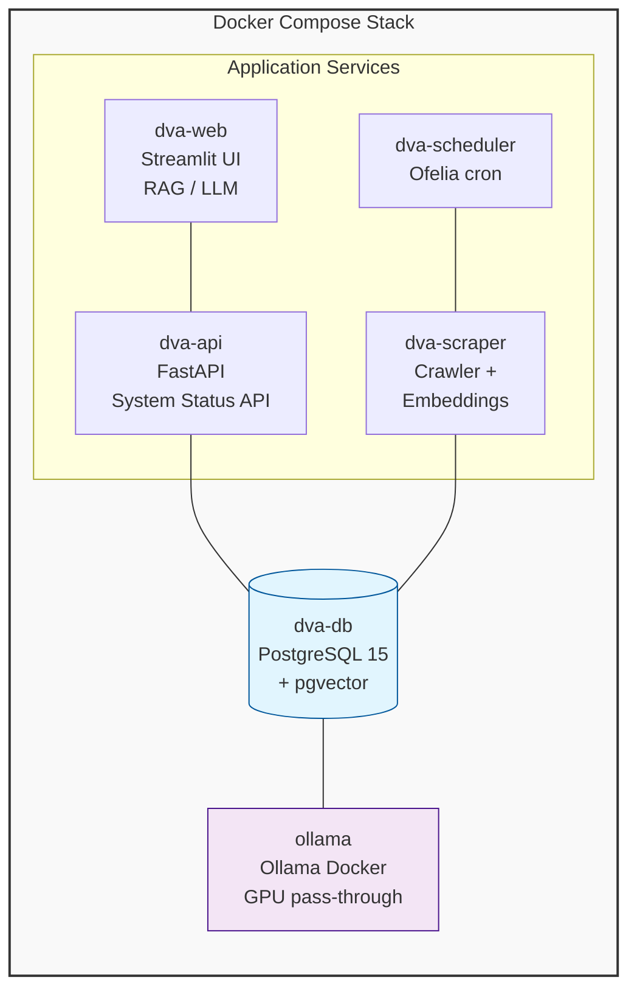

# 🎖️ ADF Veteran's DVA Assistant

> **Enhanced RAG system with multi-model routing, improved embeddings, and hardware-adaptive model selection**

[](https://www.docker.com/)
[](https://www.postgresql.org/)
[](https://www.python.org/)
[](https://streamlit.io/)
[](https://ollama.com/)

**Author:** Ben Reay

---

## Overview

The **ADF Veteran's DVA Assistant** is a Retrieval-Augmented Generation (RAG) system that lets veterans query DVA legislation, policy, and support services in plain language. Every component runs locally inside Docker — no cloud APIs, no data leaving the network.

### Key Features

- **Multi-model routing** - Automatically selects optimal model based on query complexity
- **Hardware detection** - Auto-detects GPU and recommends optimal models
- **Dynamic System Load** - Real-time metrics in sidebar, updates on page interaction
- **Improved embeddings** - Support for mxbai-embed-large (1024-dim) 
- **Context summarization** - qwen2.5:7b compresses context to fit more relevant content
- **SQL specialist** - codellama:7b generates more accurate database queries
- **Common veteran questions** - Dropdown in sidebar for quick access
- **Session memory** - Remembers veteran's context (service, conditions) within session

The system combines two retrieval strategies:
- **Text-to-SQL** for structured queries (Acts, service categories, standards of proof)
- **Semantic vector search** (pgvector) for policy and knowledge

A lexical + semantic **re-ranker** ensures the most relevant content per trust level appears first in the LLM context window.

### Source Authority Tiers

| Level | Source | Domain(s) | Notes |
| --- | --- | --- | --- |
| **L1** | Federal Legislation | legislation.gov.au, rma.gov.au | Binding law and Statements of Principles |
| **L2** | CLIK Official | clik.dva.gov.au | Binding compensation policy interpretation |
| **L3** | DVA.gov.au | dva.gov.au (non-CLIK) | Official DVA informational pages |
| **L3** | Government Other | Other .gov.au | Non-DVA government sources |
| **L4** | Service Providers | Non-gov domains | Advocacy and support organisations |
| **L5** | Community | reddit.com/r/DVAAustralia | User posts — always verify against L1–L3 |

---

## ⚖️ DVA Legislation Hierarchy — MRCA Primacy from 1 July 2026

| Act | Full Name | Relevance from 1 July 2026 |
| --- | --- | --- |
| **MRCA** | Military Rehabilitation and Compensation Act 2004 | **Primary Act** — all new compensation and rehabilitation claims |
| **DRCA** | Safety, Rehabilitation and Compensation (Defence-related Claims) Act 1988 | Legacy claims lodged before 1 July 2026 |
| **VEA** | Veterans' Entitlements Act 1986 | Legacy claims; pensions and income-support payments |

The system applies MRCA priority through re-ranker boosts and LLM prompt instructions.

---

## Architecture



### Services

| Container | Image | Purpose |
| --- | --- | --- |
| `ollama` | `ollama/ollama:0.6.1` | LLM inference + embeddings (GPU-accelerated) |
| `dva-db` | `pgvector/pgvector:pg15` | PostgreSQL 15 + pgvector extension |
| `dva-web` | `dva-assistant-web` | Streamlit UI + RAG pipeline |
| `dva-api` | `dva-assistant-api` | FastAPI for System Status polling |
| `dva-scraper` | `dva-assistant-scraper` | Multi-source web crawler |
| `dva-scheduler` | `mcuadros/ofelia:0.3.10` | Scheduled scrape jobs (runs monthly) |

---

## Features

| Feature | Description |
|---------|-------------|
| Multi-source knowledge base | CLIK, DVA.gov.au, legislation.gov.au, Support sites |
| Multi-model routing | Auto-selects optimal model by query complexity |
| Hardware detection | GPU detection with model recommendations |
| Dynamic System Load | Real-time weighted metrics (GPU/CPU/VRAM/Mem/Disk/Net) with manual refresh |
| System Load thresholds | Color-coded warnings: ≤50% green, 51-70% yellow, 71-90% orange, >90% red |
| Hardware-adaptive weights | Dynamic weighting adjusts based on GPU availability and VRAM pressure |
| Task-bound detection | Detects GPU/CPU/VRAM/Disk/Network-bound tasks and applies 95% weight to bottleneck |
| Task-aware ramping | Weight emphasis ramps up over 2-3 refresh cycles for smooth transitions |
| Ollama activity detection | Shows when Ollama is processing requests |
| GPU temperature monitoring | Warning when GPU temp ≥80°C |
| Common veteran questions | Top 50 FAQ for improved semantic search |
| Statement vs. question classification | Personal context acknowledged without LLM call |
| Session context memory | Remembers veteran-provided context within session |
| Persistent Q&A memory | Stores Q&A pairs in database for retrieval |
| Lexical + semantic re-ranking | TF-IDF + cosine similarity |
| DVA Acts priority boost | MRCA, DRCA, VEA content boosted |
| Conflict detection | Authoritative vs community source disagreement |
| Full audit log | Every query logged with flag support |
| Change-detection scraping | SHA-256 hash skips unchanged pages |
| Freshness skip | 7-day check before re-scraping |
| Legislation currency | /asmade rewritten to /latest |

---

## Prerequisites

### Hardware

* **GPU**: NVIDIA GTX 1060 6 GB minimum (CPU-only possible but slower)
* **RAM**: 16 GB minimum
* **Disk**: 20 GB free

### Operating System

| OS | Status |
| --- | --- |
| **Windows 11** | ✅ WSL 2 + Docker Desktop |
| **macOS** | ✅ CPU-only |
| **Linux** | ✅ Ubuntu 20.04+ |

### Python Dependencies

Core dependencies (installed automatically via Dockerfile):

| Package | Version | Purpose |
|---------|---------|---------|
| streamlit | ≥1.30.0 | Web UI framework |
| streamlit-autorefresh | ≥1.0.0 | Auto-refresh for System Load |
| streamlit-javascript | ≥0.1.0 | JavaScript integration for polling |
| psutil | ≥5.9.0 | System metrics (CPU, memory, disk) |
| psycopg2-binary | ≥2.9.0 | PostgreSQL connection |
| pgvector | ≥0.2.0 | Vector similarity search |
| langchain-ollama | ≥0.1.0 | Ollama LLM integration |
| playwright | ≥1.40.0 | Web scraping |
| beautifulsoup4 | ≥4.12.0 | HTML parsing |

---

## Quick Start

### 1. Clone and Setup

```powershell
git clone <repo-url> C:\projects\dva-assistant
cd C:\projects\dva-assistant
```

### 2. Configure Environment

```powershell
Rename-Item "_env" ".env"
```

Edit `.env`:

```env
DATABASE_URL=postgresql://postgres:vets_secure_pw@db:5432/dva_db
OLLAMA_BASE_URL=http://ollama:11434
MODEL_NAME=llama3.1:8b
MODEL_COMPLEX=qwen2.5:14b
SQL_MODEL=codellama:7b
SUMMARIZER_MODEL=qwen2.5:7b
EMBEDDING_MODEL=mxbai-embed-large
EMBEDDING_DIM=1024
LLM_CTX=8192
```

### 3. Initialize Database

```powershell
New-Item -ItemType Directory -Path ".\initdb" -Force
Copy-Item ".\app\init.sql" ".\initdb\init.sql"
```

### 4. Start Stack

> **Important:** The web container requires GPU access for optimal performance. The docker-compose.yml includes GPU passthrough configuration.

```bash
docker compose build
docker compose up -d
```

> **First-time setup:** After containers start, verify GPU is detected in the UI sidebar. If it shows "CPU only", check that NVIDIA drivers are installed and Docker Desktop has GPU access enabled.

### 5. Pull Models

```bash
docker exec dva-ollama ollama pull llama3.1:8b
docker exec dva-ollama ollama pull qwen2.5:14b
docker exec dva-ollama ollama pull codellama:7b
docker exec dva-ollama ollama pull qwen2.5:7b
docker exec dva-ollama ollama pull mxbai-embed-large
```

### 6. Open UI

Navigate to [http://localhost:8501](http://localhost:8501)

---

## Project Structure

```
dva-assistant/
├── .env                          ← environment config
├── _env                          ← environment template
├── docker-compose.yml
├── admin_tasks.ps1               ← Admin console (Windows)
├── backups/                      ← Backup storage
├── initdb/
│   └── init.sql                  ← Database schema
└── app/
    ├── main.py                   ← Core RAG pipeline
    ├── ui.py                     ← Streamlit interface
    ├── scraper.py                ← Web crawler
    ├── model_manager.py           ← Hardware detection
    ├── sql_generator.py           ← SQL generation
    ├── context_summarizer.py      ← Context compression
    ├── reembed.py                 ← Embedding reindexing
    ├── health.py                  ← Health checks
    ├── veteran_faq.py             ← Common veteran questions
    ├── migrate.py                 ← Schema verification
    ├── requirements.txt
    └── Dockerfile
```

---

## Configuration Reference

| Variable | Description | Default |
| --- | --- | --- |
| `DATABASE_URL` | PostgreSQL connection | postgresql://postgres:...@db:5432/dva_db |
| `OLLAMA_BASE_URL` | Ollama API | http://ollama:11434 |
| `MODEL_NAME` | Chat model | llama3.1:8b |
| `MODEL_COMPLEX` | Reasoning model | qwen2.5:14b |
| `SQL_MODEL` | SQL model | codellama:7b |
| `SUMMARIZER_MODEL` | Summarizer model | qwen2.5:7b |
| `EMBEDDING_MODEL` | Embeddings | mxbai-embed-large |
| `LLM_CTX` | Context window | 8192 |

---

## Hardware-Adaptive Models

| VRAM | Chat | Reasoning | SQL | Embeddings |
|------|------|-----------|-----|------------|
| 0-4 GB | phi3:3.8b-mini | phi3:3.8b-mini | phi3:3.8b-mini | nomic-embed-text |
| 4-6 GB | llama3.1:8b | qwen2.5:14b | codellama:7b | mxbai-embed-large |
| 6-8 GB | llama3.1:8b | qwen2.5:14b | codellama:7b | mxbai-embed-large |
| 8-12 GB | llama3.1:8b | qwen2.5:14b | codellama:7b | mxbai-embed-large |
| 12+ GB | llama3.1:8b | deepseek-coder-v2:236b | codellama:7b | mxbai-embed-large |

---

## System Load Monitoring

The UI sidebar displays a **System Load (%)** bar with dynamic color coding. The System Status section updates automatically when you interact with the page (send messages, click expanders, etc.).

| Load Range | Color | Hex |
|-------------|-------|-----|
| ≤50% | Green | #22c55e |
| 51-70% | Canary Yellow | #ffef00 |
| 71-90% | Orange | #f97316 |
| >90% | Red | #ef4444 |

### Dynamic Weighting

System load uses hardware-adaptive weights:

| Scenario | GPU | VRAM | CPU | Memory | Disk | Network |
|----------|-----|------|-----|--------|------|---------|
| GPU available (normal) | 40% | 15% | 20% | 10% | 10% | 5% |
| GPU available (high VRAM ≥85%) | 30% | 25% | 15% | 10% | 15% | 5% |
| CPU only | 0% | 0% | 50% | 25% | 20% | 5% |

### Task-Bound Detection

When a specific hardware resource becomes the bottleneck, the system detects it and applies 95% weight to that component:

| Detected Task | Trigger Condition | UI Display |
|---------------|------------------|------------|
| GPU-Bound | Ollama active + GPU ≥70% | "GPU-Bound (embedding/inference)" |
| VRAM-Bound | VRAM ≥90% | "VRAM-Bound (memory pressure)" |
| CPU-Bound | CPU ≥85% + GPU <50% | "CPU-Bound (processing)" |
| Disk I/O-Bound | Disk ≥80% + CPU <70% | "Disk I/O-Bound" |
| Network-Bound | Network ≥70% + GPU/CPU <50% | "Network-Bound" |

**Ramping:** Weight emphasis ramps from 0% to 95% over 3 refresh cycles for smooth transitions.

### Warnings

Warnings appear when thresholds are exceeded:

| Warning | Threshold | Behavior |
|---------|-----------|----------|
| GPU hot | GPU Temp ≥80°C | Shows warning, dismissible for 30s |
| VRAM critical | VRAM ≥90% | Shows warning with ✕ button, dismissible for 30s |
| Memory critical | Memory ≥90% | Shows warning, dismissible for 30s |
| CPU critical | CPU ≥90% | Shows warning, dismissible for 30s |

### Model Suggestions

The System Status section includes an expandable **Model Suggestion** panel that:

- Automatically detects available VRAM
- Suggests optimal model based on VRAM (14b, 8b, 7b, or codellama)
- Recommends upgrade if current model doesn't fit
- Works with hardware upgrades (e.g., 6GB → 12GB GPU)

| Available VRAM | Suggested Model |
|----------------|-----------------|
| ≥10 GB | qwen2.5:14b |
| ≥6 GB | llama3.1:8b |
| ≥5.5 GB | qwen2.5:7b |
| ≥5 GB | codellama:7b |
| <5 GB | llama3.1:8b (or reduce embeddings)

---

## Admin Console (`admin_tasks.ps1`)

```powershell
.\admin_tasks.ps1
```

The admin console provides a menu-driven interface for managing the DVA Assistant stack.

### Main Menu

| Option | Description |
| --- | --- |
| [1] Restart Application | Full/rolling/per-service restart, rebuild |
| [2] GPU Management | View stats, test GPU, toggle GPU mode |
| [3] Manage Models | List/pull/delete models, switch active model |
| [4] Data Management | Backup/restore, database utilities |
| [5] Diagnostic | Container status, API tests, view logs |

### Features
- Screen clears after actions complete (except errors)
- "Press any key to continue" for output-heavy operations
- Consolidated menu structure for easier navigation
- GPU statistics refresh with 'R' key

---

### GPU Management (Option 2)

| Sub-Option | Description |
| --- | --- |
| [1] View GPU Statistics | Real-time GPU stats (utilization, memory, temperature, power). Press R to refresh, any key to exit. |
| [2] Test GPU in Docker | Verifies GPU is accessible from within Docker containers. Auto-pulls CUDA image on first run. |
| [3] View NVIDIA Driver | Shows installed driver version and compute capability |
| [4] Toggle GPU Mode | Enable/disable GPU acceleration in docker-compose.yml. Requires restart to take effect. |

---

### Manage Models (Option 3)

| Sub-Option | Description |
| --- | --- |
| [1] List Installed | Shows all Ollama models currently pulled |
| [2] Pull Model | Download a new model from Ollama library |
| [3] Delete Model | Remove a model to free disk space |
| [4] Switch Model | Change active model for chat/reasoning/SQL/summarization/embeddings |

#### Available Models (configured in .env)
| Model Type | Variable | Default | Purpose |
| --- | --- | --- | --- |
| Chat | MODEL_NAME | llama3.1:8b | General conversation |
| Reasoning | MODEL_COMPLEX | qwen2.5:14b | Complex queries |
| SQL | SQL_MODEL | codellama:7b | Database queries |
| Summarizer | SUMMARIZER_MODEL | qwen2.5:7b | Context compression |
| Embeddings | EMBEDDING_MODEL | mxbai-embed-large | Vector search (1024-dim) |

---

### Data Management (Option 4)

| Sub-Option | Description |
| --- | --- |
| [1] Create Backup | Saves database to `backups/` folder with timestamp |
| [2] List Backups | Shows available backup folders and dates |
| [3] Restore | Restores database from a backup folder |
| [4] Delete Old | Removes backups older than 30 days |
| [5] Database Utilities | Run tests, scraper, reembed tool |

#### Database Utilities (within Data Management)

| Sub-Option | Description |
| --- | --- |
| [1] Test Import | Verifies Python modules load correctly |
| [2] Run Scraper | Scrapes 100 pages (respects 7-day freshness) |
| [3] Force Scrape | Scrapes 3000 pages ignoring freshness |
| [4] Run Reembed | Migrates embeddings with real-time progress |
| [5] Content Stats | Shows scraped content by source type |
| [6] Verify Reembed | Check migration status (rows embedded) |
| [7] Create Index | Create HNSW index for faster vector search |

#### Reembed Tool

The reembed tool migrates content embeddings from one model to another (e.g., nomic-embed-text to mxbai-embed-large).

> **Note:** v2 already uses `mxbai-embed-large` by default. This tool is mainly useful if you migrated data from v1.

```bash
# Run reembed
docker exec dva-scraper python reembed.py

# Verify migration status
docker exec dva-scraper python reembed.py --verify

# Create HNSW index for faster vector search
docker exec dva-scraper python reembed.py --create-index
```

---

### Diagnostic (Option 5)

| Sub-Option | Description |
| --- | --- |
| Status | Shows all container statuses (ollama, db, web, scraper) |
| Ollama Test | Verifies API connectivity and lists models |
| Database Test | Checks connection and content count |
| Disk Space | Shows available drive space |
| [V] View Logs | Tail container logs in real-time |

---

## Troubleshooting

| Symptom | Fix |
| --- | --- |
| dva-db not healthy | `docker compose down -v && docker compose up -d` |
| Ollama not responding | `docker compose restart ollama` |
| Models not found | `docker exec dva-ollama ollama pull <model>` |
| UI won't load | `docker compose restart web` |
| GPU shows "CPU only" | 1. Install NVIDIA driver 2. Restart Docker Desktop 3. Rebuild web: `docker compose build web` |
| nvidia-smi fails in container | Install NVIDIA Container Toolkit or use Docker Desktop with WSL 2 |

### GPU Configuration

The docker-compose.yml includes GPU passthrough for both the `ollama` and `web` containers. If GPU is not detected:

1. **Windows:** Ensure NVIDIA drivers are installed and Docker Desktop has WSL 2 integration enabled
2. **Linux:** Install NVIDIA Container Toolkit: `nvidia-ctk runtime configure --runtime=docker`

Verify GPU access:
```bash
docker exec dva-web nvidia-smi
```

---

## Database Schema

### Tables

| Table | Purpose |
| --- | --- |
| `scraped_content` | Crawled pages with embeddings |
| `dva_acts` | VEA, MRCA, DRCA reference |
| `service_categories` | Service types and standards |
| `query_audit_log` | Query history with flags |
| `conversation_memory` | Persistent Q&A pairs |
| `scrape_seeds` | Seed URLs |
| `scrape_log` | Scrape job history |

---

## Security

| Control | Status |
| --- | --- |
| All inference local | ✅ |
| Docker network isolation | ✅ |
| SQL injection prevention | ✅ |
| Query audit logging | ✅ |

---

## Future Improvements

The following enhancements are planned or under consideration for future releases:

### High Priority

| # | Improvement | Description |
|---|-------------|-------------|
| 1 | **Vector Index Optimization** | Implement HNSW index for faster similarity search at scale |
| 2 | **Incremental Embedding** | Only embed new/changed content instead of full reembed |
| 3 | **Query Caching** | Cache frequent queries to reduce LLM API calls |
| 4 | **Better Error Handling** | Graceful degradation when Ollama models unavailable |

### Medium Priority

| # | Improvement | Description |
|---|-------------|-------------|
| 5 | **Multi-user Support** | User authentication and personalized history |
| 6 | **Citation Verification** | Auto-verify links are still active |
| 7 | **Model Hot-swap** | Switch models without container restart |
| 8 | **Export Chat History** | Download conversation as PDF/Markdown |

### Low Priority / Experimental

| # | Improvement | Description |
|---|-------------|-------------|
| 9 | **Voice Input** | Speech-to-text for accessibility |
| 10 | **RAG Fine-tuning** | Fine-tune embeddings on veteran Q&A data |
| 11 | **Agentic Scraping** | LLM-guided intelligent crawling |
| 12 | **Metrics Dashboard** | Historical system load graphs |

---

**Version:** 2.0
**Last updated:** March 2026
**Author:** Ben Reay
