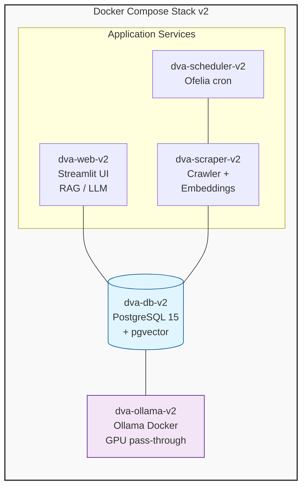

# 🎖️ ADF Veteran's DVA Assistant v2

> **Enhanced RAG system with multi-model routing, improved embeddings, and hardware-adaptive model selection**

[](https://www.docker.com/)
[](https://www.postgresql.org/)
[](https://www.python.org/)
[](https://streamlit.io/)
[](https://ollama.com/)

**Author:** Ben Reay

---

## Overview

The **ADF Veteran's DVA Assistant v2** is a Retrieval-Augmented Generation (RAG) system that lets veterans query DVA legislation, policy, and support services in plain language. Every component runs locally inside Docker — no cloud APIs, no data leaving the network.

v2 enhances the original v1 with:
- **Multi-model routing** - Automatically selects optimal model based on query complexity
- **Hardware detection** - Auto-detects GPU and recommends optimal models
- **Improved embeddings** - Support for mxbai-embed-large (1024-dim) 
- **Context summarization** - qwen2.5:7b compresses context to fit more relevant content
- **SQL specialist** - codellama:7b generates more accurate database queries

The system combines two retrieval strategies:
- **Text-to-SQL** for structured queries (Acts, service categories, standards of proof)
- **Semantic vector search** (pgvector) for policy and knowledge

A lexical + semantic **re-ranker** ensures the most relevant content per trust level appears first in the LLM context window.

### Source Authority Tiers

| Level | Source | Domain(s) | Notes |
| --- | --- | --- | --- |
| **L1** | Federal Legislation | legislation.gov.au, rma.gov.au | Binding law and Statements of Principles |
| **L2** | CLIK Official | clik.dva.gov.au | Binding compensation policy interpretation |
| **L3** | DVA.gov.au | dva.gov.au (non-CLIK) | Official DVA informational pages |
| **L3** | Government Other | Other .gov.au | Non-DVA government sources |
| **L4** | Service Providers | Non-gov domains | Advocacy and support organisations |
| **L5** | Community | reddit.com/r/DVAAustralia | User posts — always verify against L1–L3 |

---

## ⚖️ DVA Legislation Hierarchy — MRCA Primacy from 1 July 2026

The three Acts that govern the vast majority of Australian veteran compensation and rehabilitation claims are:

| Act | Full Name | Relevance from 1 July 2026 |
| --- | --- | --- |
| **MRCA** | Military Rehabilitation and Compensation Act 2004 | **Primary Act** — all new compensation and rehabilitation claims |
| **DRCA** | Safety, Rehabilitation and Compensation (Defence-related Claims) Act 1988 | Legacy claims lodged before 1 July 2026; existing entitlements |
| **VEA** | Veterans' Entitlements Act 1986 | Legacy claims; pensions and income-support payments continue |

### What changes on 1 July 2026

From 1 July 2026, **all new compensation and rehabilitation claims** — including claims that would previously have been determined under the DRCA or the VEA — are determined under the **MRCA**.

This does **not** affect:
- Existing entitlements already granted under DRCA or VEA
- Claims lodged before 1 July 2026
- VEA pension and income-support payments

### How the assistant handles this

The system applies MRCA priority at multiple levels:
1. **Re-ranker boost** — MRCA, DRCA, and VEA content receives a within-bucket score boost
2. **LLM prompt instruction** — The model is explicitly instructed to lead with MRCA for new-claim answers

---

## Architecture



### Services

| Container | Image | Purpose |
| --- | --- | --- |
| `dva-ollama-v2` | `ollama/ollama:0.6.1` | LLM inference + embeddings (GPU-accelerated) |
| `dva-db-v2` | `pgvector/pgvector:pg15` | PostgreSQL 15 + pgvector extension |
| `dva-web-v2` | `dva-assistant-web-v2` | Streamlit UI + RAG pipeline |
| `dva-scraper-v2` | `dva-assistant-scraper-v2` | Multi-source web crawler |
| `dva-scheduler-v2` | `mcuadros/ofelia:0.3.10` | Scheduled scrape jobs |

---

## Features

### Core Features (v1 + v2)

| Feature | Status | Notes |
|---------|--------|-------|
| Multi-source knowledge base | ✅ Implemented | CLIK, DVA.gov.au, legislation.gov.au |
| Statement vs. question classification | ✅ Implemented | In `main.py` |
| Veteran context block | ✅ Implemented | Session history handling |
| Lexical + semantic re-ranking | ✅ Implemented | TF-IDF + cosine similarity |
| DVA Acts priority boost | ✅ Implemented | MRCA, DRCA, VEA |
| MRCA primacy guidance | ✅ Implemented | System prompt instructions |
| Expanded LLM context window | ✅ Implemented | Configurable via `LLM_CTX` |
| Persistent conversation memory | ✅ Implemented | Cross-session learning |
| Conflict detection | ✅ Implemented | Authoritative vs community |
| Full audit log | ✅ Implemented | With flag support |
| Change-detection scraping | ✅ Implemented | SHA-256 hash comparison |
| Freshness skip | ✅ Implemented | 7-day check |
| Legislation currency enforcement | ✅ Implemented | /asmade to /latest |
| Duplicate source card suppression | ✅ Implemented | URL and title dedup |

### Enhanced Features (v2)

| Feature | Description |
|---------|-------------|
| **Multi-Model Routing** | Questions automatically routed to optimal model based on complexity |
| **Hardware Detection** | Automatic GPU detection with model recommendations |
| **Improved Embeddings** | Support for mxbai-embed-large (1024-dim) |
| **Context Summarization** | qwen2.5:7b compresses context for more relevant content |
| **SQL Specialist** | codellama:7b generates more accurate database queries |

### Features NOT Applicable to v2

<span style="color: red">The following v1 features are NOT implemented in v2:</span>

| Feature | Reason |
|---------|--------|
| Seed URL management UI | Not applicable - Sidebar UI for seed submission not implemented in v2 |
| Dead-page detection and retirement | Not applicable - Simplified scraper in v2 |
| On-demand URL indexing | Not applicable - Requires UI implementation |
| Document upload ingestion | Not applicable - PDF/DOCX upload not implemented |
| Multi-conversation UI | Not applicable - Single conversation view in v2 |
| Auto-scroll with down arrow button | Not applicable - Streamlit handles scrolling natively |
| CLIK round-robin DFS crawling | Not applicable - Simplified DFS in v2 |

---

## What's New in v2

### Multi-Model Routing

Questions are automatically classified and routed to the optimal model:

```
Query → Complexity Classification → Model Selection
                                    ├── simple → llama3.1:8b
                                    ├── technical → codellama:7b  
                                    └── complex → qwen2.5:14b
```

### Hardware-Adaptive Model Selection

v2 automatically detects your GPU and recommends optimal models:

| VRAM | Chat Model | Reasoning Model | SQL Model | Embeddings |
|------|------------|-----------------|-----------|-------------|
| 0-4 GB | phi3:3.8b-mini | phi3:3.8b-mini | phi3:3.8b-mini | nomic-embed-text |
| 4-6 GB | llama3.1:8b | qwen2.5:14b | codellama:7b | mxbai-embed-large |
| 6-8 GB | llama3.1:8b | qwen2.5:14b | codellama:7b | mxbai-embed-large |
| 8-12 GB | llama3.1:8b | qwen2.5:14b | codellama:7b | mxbai-embed-large |
| 12+ GB | llama3.1:8b | deepseek-coder-v2:236b | codellama:7b | mxbai-embed-large |

### Context Summarization

When retrieved context exceeds token limits, qwen2.5:7b compresses the context while preserving key facts, dates, and legislation references.

---

## Prerequisites

### Hardware

* **GPU**: NVIDIA GTX 1060 6 GB minimum for practical inference speed
* **RAM**: 16 GB minimum
* **Disk**: 20 GB free

### Operating System

| OS | Status |
| --- | --- |
| **Windows 11** | ✅ Supported (WSL 2 + Docker Desktop) |
| **macOS** | ✅ Supported (CPU-only, GPU passthrough not available) |
| **Linux** | ✅ Supported (Ubuntu 20.04+) |

---

## Quick Start

### 1. Clone and Setup

```powershell
git clone <repo-url> C:\projects\dva-assistant-v2
cd C:\projects\dva-assistant-v2
```

### 2. Configure Environment

```powershell
mv _env .env
```

Edit `.env` with your settings:

```env
DATABASE_URL=postgresql://postgres:vets_secure_pw@db:5432/dva_db
OLLAMA_BASE_URL=http://ollama:11434
MODEL_NAME=llama3.1:8b
MODEL_COMPLEX=qwen2.5:14b
SQL_MODEL=codellama:7b
SUMMARIZER_MODEL=qwen2.5:7b
EMBEDDING_MODEL=mxbai-embed-large
EMBEDDING_DIM=1024
LLM_CTX=8192
```

### 3. Initialize Database

```powershell
New-Item -ItemType Directory -Path ".\initdb" -Force
Copy-Item ".\app\init.sql" ".\initdb\init.sql"
```

### 4. Start Stack

```bash
docker compose build
docker compose up -d
```

### 5. Pull Models

```bash
docker exec dva-ollama-v2 ollama pull llama3.1:8b
docker exec dva-ollama-v2 ollama pull qwen2.5:14b
docker exec dva-ollama-v2 ollama pull codellama:7b
docker exec dva-ollama-v2 ollama pull qwen2.5:7b
docker exec dva-ollama-v2 ollama pull mxbai-embed-large
```

### 6. Open UI

Navigate to [http://localhost:8502](http://localhost:8502)

---

## Project Structure

```
dva-assistant-v2/
├── .env                          ← environment config
├── _env                          ← environment template
├── docker-compose.yml
├── admin_tasks.ps1               ← Admin console (Windows)
├── backups/                      ← Backup storage
├── initdb/
│   └── init.sql                  ← Database schema
└── app/
    ├── main.py                   ← Core RAG pipeline
    ├── ui.py                     ← Streamlit interface
    ├── scraper.py                ← Web crawler
    ├── model_manager.py          ← Hardware detection
    ├── sql_generator.py          ← SQL generation
    ├── context_summarizer.py     ← Context compression
    ├── reembed.py                ← Embedding migration
    ├── health.py                 ← Health checks
    ├── migrate_proper.py         ← v1→v2 migration
    ├── requirements.txt
    └── Dockerfile
```

---

## Database Schema

### Tables

| Table | Purpose |
| --- | --- |
| `scraped_content` | All crawled pages — chunked, embedded, trust level |
| `dva_acts` | VEA, MRCA, DRCA reference data |
| `service_categories` | Service types and standards of proof |
| `query_audit_log` | Every RAG query — sources, latency, flags |
| `conversation_memory` | Persistent Q&A pairs |
| `scrape_seeds` | Seed URLs for scheduled scraping |
| `scrape_log` | Scrape job run history |

### Key Columns

```sql
source_url     TEXT         -- normalised URL
source_type    VARCHAR(50)  -- LEGISLATION | CLIK | DVA_GOV | SUPPORT | REDDIT
chunk_index    INT          -- position within page
embedding      vector(768)  -- nomic-embed-text
embedding_mxbai vector(1024) -- mxbai-embed-large
trust_level    SMALLINT     -- 1=Legislation 5=Community
content_hash   CHAR(64)     -- SHA-256
```

---

## Configuration Reference

| Variable | Description | Default |
| --- | --- | --- |
| `DATABASE_URL` | PostgreSQL connection string | postgresql://postgres:...@db:5432/dva_db |
| `OLLAMA_BASE_URL` | Ollama API endpoint | http://ollama:11434 |
| `MODEL_NAME` | Primary chat model | llama3.1:8b |
| `MODEL_COMPLEX` | Complex reasoning model | qwen2.5:14b |
| `SQL_MODEL` | SQL generation model | codellama:7b |
| `SUMMARIZER_MODEL` | Context summarization model | qwen2.5:7b |
| `EMBEDDING_MODEL` | Embedding model | mxbai-embed-large |
| `EMBEDDING_DIM` | Embedding dimension | 1024 |
| `LLM_CTX` | Context window (tokens) | 8192 |

---

## Admin Console (`admin_tasks.ps1`)

Run from the project root:

```powershell
.\admin_tasks.ps1
```

### Menu Options

| Option | Description |
| --- | --- |
| **[1] Restart Application** | Full restart, rolling restart, per-service, rebuild |
| **[2] GPU Management** | View GPU stats, test Docker GPU access |
| **[3] Switch Model** | Change LLM, embedding, or context window |
| **[4] Enable / Disable GPU Mode** | Toggle docker-compose.yml GPU block |
| **[5] Full Diagnostic** | Health check all containers and services |
| **[6] Data Management** | Create, list, restore backups |
| **[7] Pull / Manage Models** | Pull, list, delete Ollama models |
| **[8] View Logs** | Tail container logs |
| **[9] Database Utilities** | Run tests, scraper, reembed |

---

## Troubleshooting

| Symptom | Cause | Fix |
| --- | --- | --- |
| dva-db-v2 never healthy | Init script failed | `docker compose down -v && docker compose up -d` |
| Ollama not responding | Container not started | `docker compose restart ollama` |
| Models not found | Not pulled | `docker exec dva-ollama-v2 ollama pull <model>` |
| UI won't load | Web container crashed | `docker compose restart web` |
| GPU not detected | NVIDIA driver issue | Install/reinstall NVIDIA driver |

---

## Upgrading from v1

1. Backup v1 database
2. Start fresh v2 stack
3. Run migration script:

```bash
docker exec dva-scraper-v2 python migrate_proper.py
docker exec dva-scraper-v2 python reembed.py
```

---

## Security

| Control | Status |
| --- | --- |
| All inference local | ✅ |
| Docker network isolation | ✅ |
| SQL injection prevention | ✅ |
| Query audit logging | ✅ |

---

## Performance Expectations

### Inference Speed

| Hardware | Tokens/sec |
| --- | --- |
| CPU only (8-core) | 3-8 |
| GTX 1060 6 GB | 25-40 |
| RTX 3060 12 GB | 40-60 |
| RTX 4090 24 GB | 80-120 |

---

**Version:** 2.0
**Last updated:** March 2026
**Author:** Ben Reay
**Status:** Production-ready (local deployment)
