# DVA Wizard v3.0 - Logic Flow Summary

## High-Level Architecture

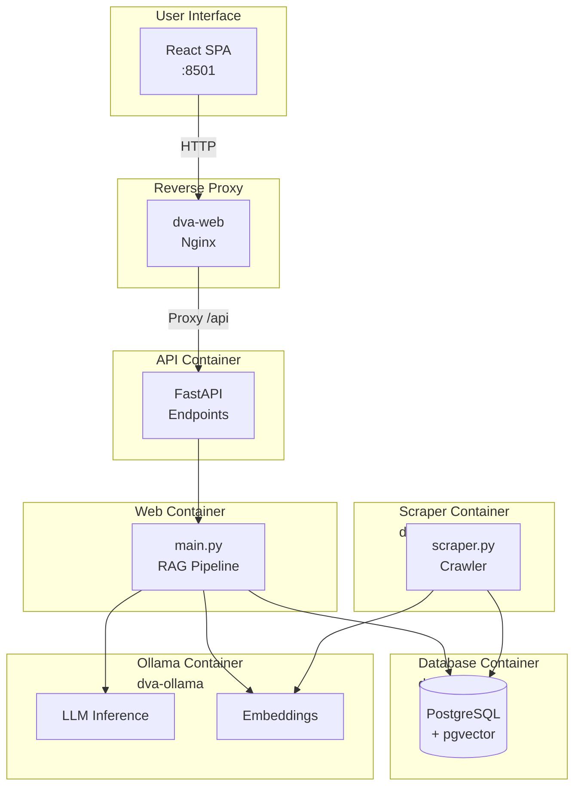

---

## Frontend-Backend Communication

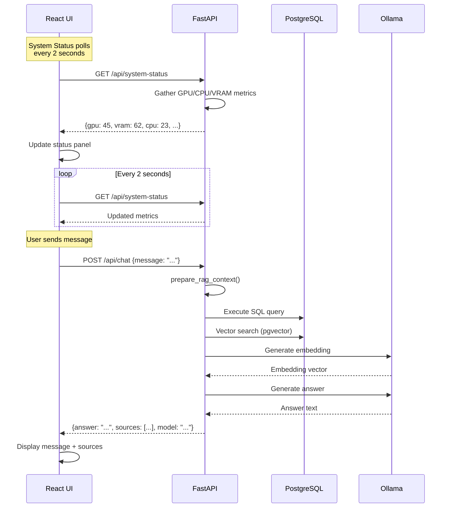

---

## Query Flow (User Asks Question)

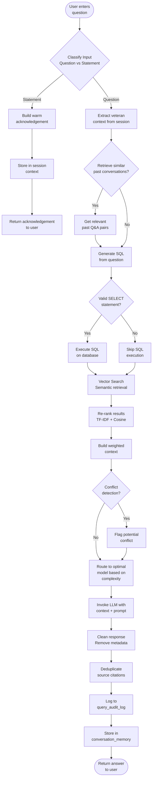

---

## Input Classification Logic

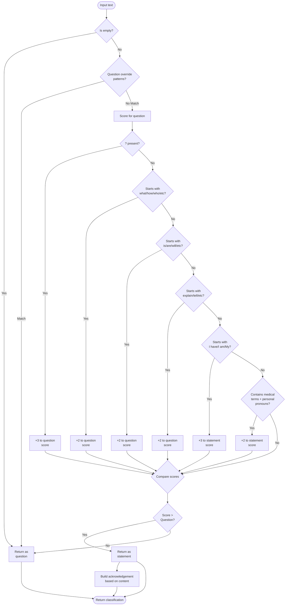

---

## Model Routing Logic

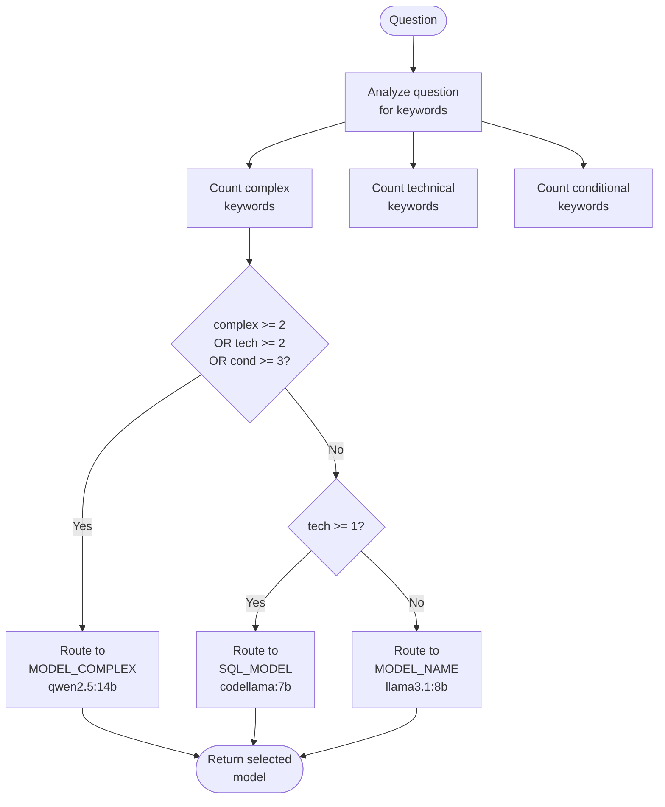

---

## Real-Time Status Polling

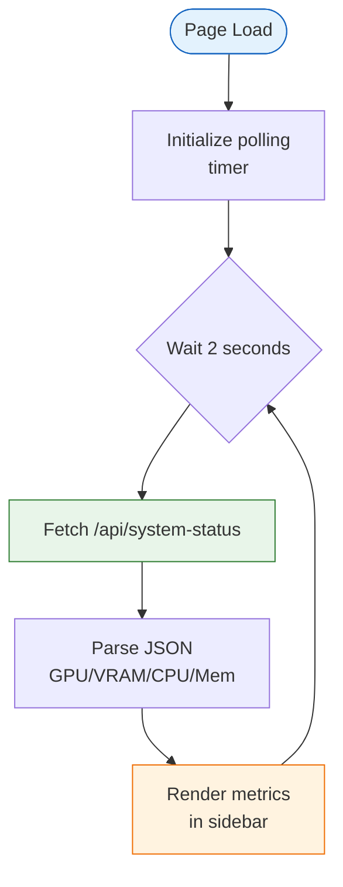

---

## System Load Calculation

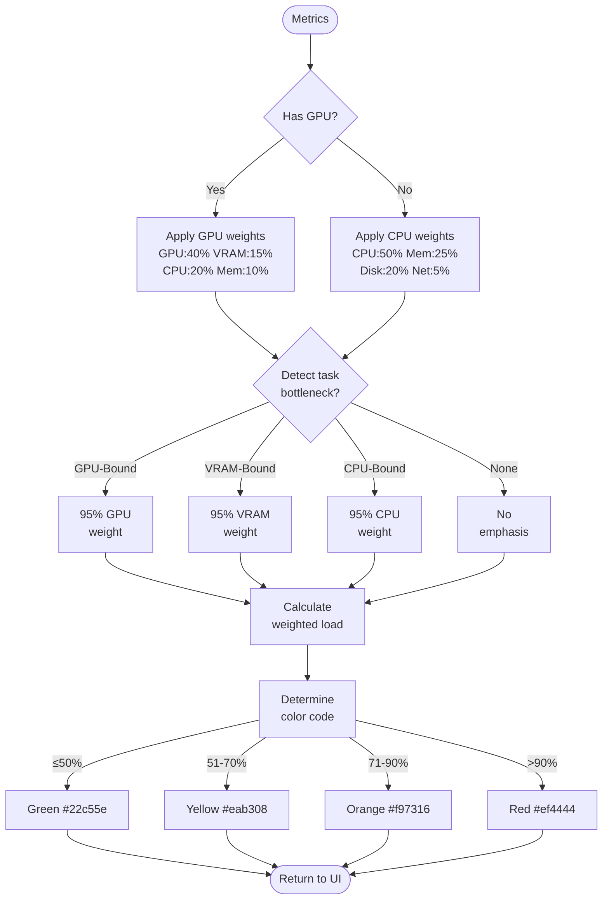

---

## Re-Ranking Logic

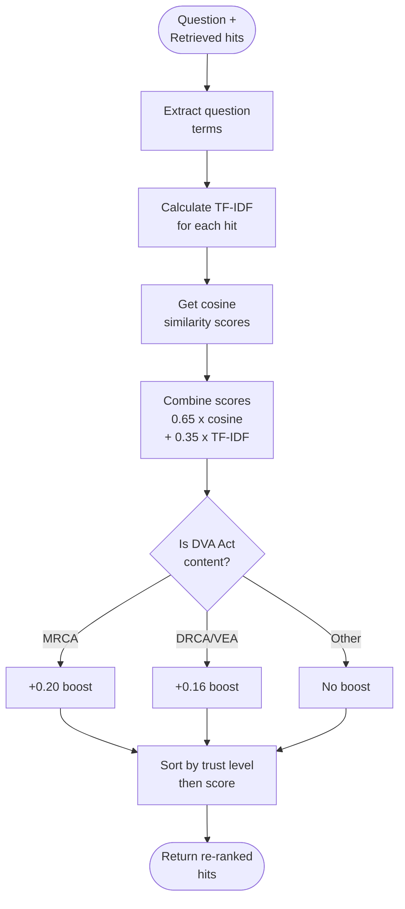

---

## Source Selection Logic

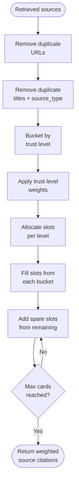

---

## Scraper Flow

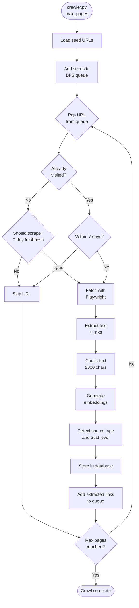

---

## Data Storage Schema

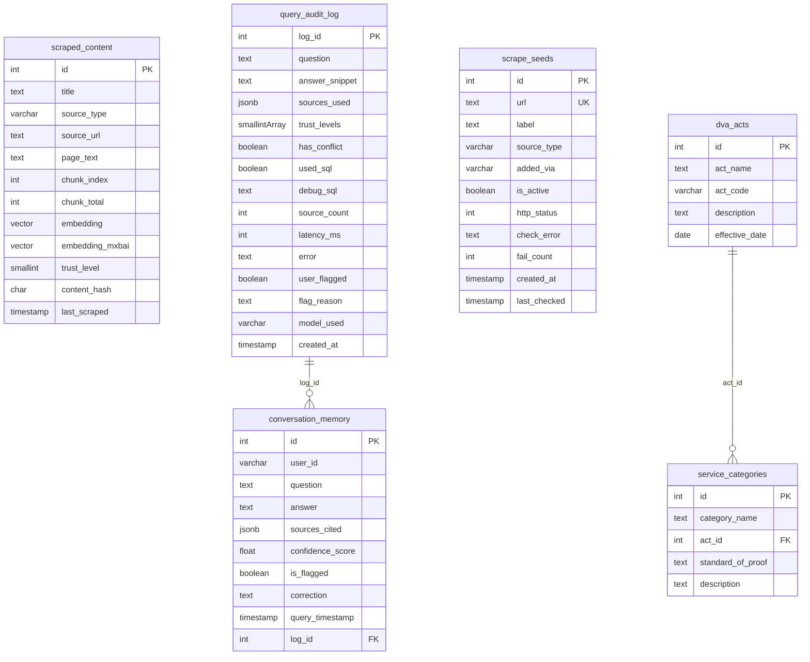

---

## Trust Level Hierarchy

| Level | Source | Weight | Description |
| --- | --- | --- | --- |
| L1 | Federal Legislation | 0.25 | legislation.gov.au, rma.gov.au |
| L2 | CLIK Official | 0.30 | clik.dva.gov.au |
| L3 | DVA.gov.au / Gov | 0.20 | dva.gov.au, other .gov.au |
| L4 | Service Providers | 0.15 | Non-gov support sites |
| L5 | Community | 0.10 | Reddit, forums |

---

## API Endpoints

| Endpoint | Method | Description |
| --- | --- | --- |
| `/api/system-status` | GET | Real-time system metrics (GPU, CPU, VRAM) |
| `/api/chat` | POST | Send chat message, receive answer |
| `/api/common-questions` | GET | Get FAQ questions by category |
| `/api/knowledge-stats` | Get | Get knowledge base statistics |
| `/api/health` | GET | Health check |

---

## Key Configuration

```yaml
# Environment Variables
MODEL_NAME: llama3.1:8b        # Primary chat model
MODEL_COMPLEX: qwen2.5:14b     # Complex reasoning
SQL_MODEL: codellama:7b         # SQL generation
SUMMARIZER_MODEL: qwen2.5:7b   # Context summarization
EMBEDDING_MODEL: mxbai-embed-large
LLM_CTX: 8192                   # Context window tokens
```

---

## File Purposes

| File | Purpose |
| --- | --- |
| `main.py` | Core RAG pipeline, query processing, LLM invocation |
| `api.py` | FastAPI endpoints for React frontend integration |
| `scraper.py` | Web crawling, content extraction, embedding generation |
| `model_manager.py` | Hardware detection, model recommendations |
| `sql_generator.py` | Natural language to SQL conversion |
| `context_summarizer.py` | Context compression for large contexts |
| `health.py` | System health checks |
| `reembed.py` | Re-embedding existing content with new models |
| `init.sql` | Database schema initialization |

### Frontend Files

| File | Purpose |
| --- | --- |
| `frontend/src/App.js` | Main React application |
| `frontend/src/components/SystemStatus.js` | Real-time status panel (2s refresh) |
| `frontend/src/components/Chat.js` | Chat interface |
| `frontend/src/components/Sidebar.js` | Common questions + settings |
| `frontend/nginx.conf` | Reverse proxy configuration |
